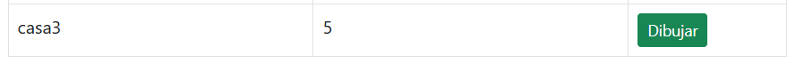

## Lab ARSW7 Parte 1

## Daniel Ricardo Ruge Gomez

### Construción de un cliente 'grueso' con un API REST, HTML5, Javascript y CSS3. Parte II.

#### 1

Se agregó un manejador de eventos al canvas mediante PointerEvent dentro de la función initCanvasEvents() del módulo BlueprintsModule, para capturar los clics realizados con mouse o pantalla táctil y dibujar un pequeño punto rojo en la posición seleccionada. Además, se modularizó esta inicialización y se llamó desde index.html al cargar la página

#### 2

Se añadieron manejadores de eventos para capturar los clics en el canvas y registrar las coordenadas solo si hay un canvas seleccionado. Cada nuevo punto se agrega a la secuencia de puntos almacenada en memoria y luego se repinta el dibujo en pantalla, sin enviar aún los datos al backend.

antes:

despues:

#### 3

Se modificó el cliente para que al oprimir el botón “Save/Update” se realice primero una petición PUT al API REST con el plano actualizado, y luego una petición GET para obtener todos los planos del autor y recalcular el total de puntos. Además, se ajustó la actualización de la tabla de planos para reflejar correctamente la lista de puntos y el total de puntos por autor, asegurando que la vista se sincronice con los datos del backend.

#### 4

Se añadió el botón Crear nuevo blueprint y la lógica asociada: al pulsarlo se limpia el canvas y se pide el nombre del nuevo plano; ese nuevo plano queda abierto en memoria como “nuevo” y al oprimir Guardar/Actualizar se hace POST /blueprints (si es nuevo) o PUT /blueprints/{author}/{name} (si ya existía), encadenando promesas para luego ejecutar un GET /blueprints (recalcular total de puntos) y un GET /blueprints/{author} para refrescar la tabla y la vista; además el módulo mantiene los arrays de puntos completos para dibujar y permite alternar entre mock y API real.

#### 5

Se agregó el botón DELETE y toda la lógica asociada: al pulsarlo se limpia el canvas, se ejecuta un DELETE /blueprints/{author}/{bpname} (tanto en el cliente real apiclient.js como en el apimock.js), y luego se encadenan promesas para hacer un GET actualizado de los planos del autor y refrescar la tabla y el total de puntos.

